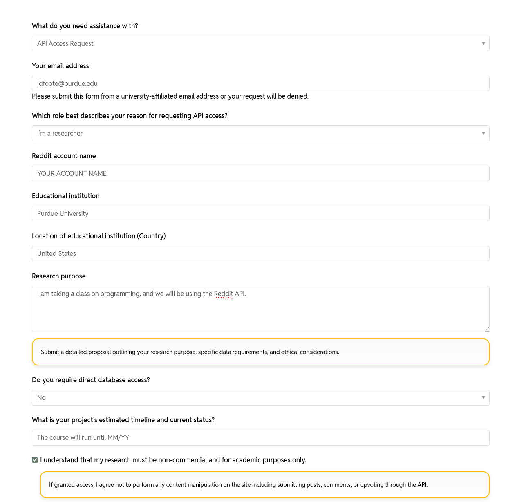

We're going to be using Reddit as a context for learning to gather web data. Like many APIs, you need a developer account to use the Reddit API. This is pretty easy on Reddit, although they've made it more difficult recently.

## Apply for API Access

Go to https://support.reddithelp.com/hc/en-us/requests/new?ticket_form_id=14868593862164&tf_14867328473236=api_request_type_research, and fill out the form, as shown below.

[](reddit_api_form.png)


## Create a Reddit App

1. Create a Reddit account at https://www.reddit.com/
2. Go to https://www.reddit.com/prefs/apps and click "Create an app"
3. Enter the following (or similar):
	- Name: COM 674 Project App
	- Description: This bot will be used to collect data as part of a course at Purdue University.
	- About URL: Leave blank
	- Redirect URL: http://localhost:8080 (we will not actually be using this)
	- Application type: Script
4. Submit the app.

## Create Your Authentication File

Create a new Python file called `reddit_authentication.py` that looks like this:

```python
client_id = "your_client_id_here"
client_secret = "your_client_secret_here"
user_agent = "python:COM 674 class project:v1.0 (by /u/yourusername)"
username = "yourusername"
password = "yourpassword"
```

The `client_id` is found at the top left of the apps page, under your app's name. The `client_secret` is right below it.

We will use this authentication file in future lessons.